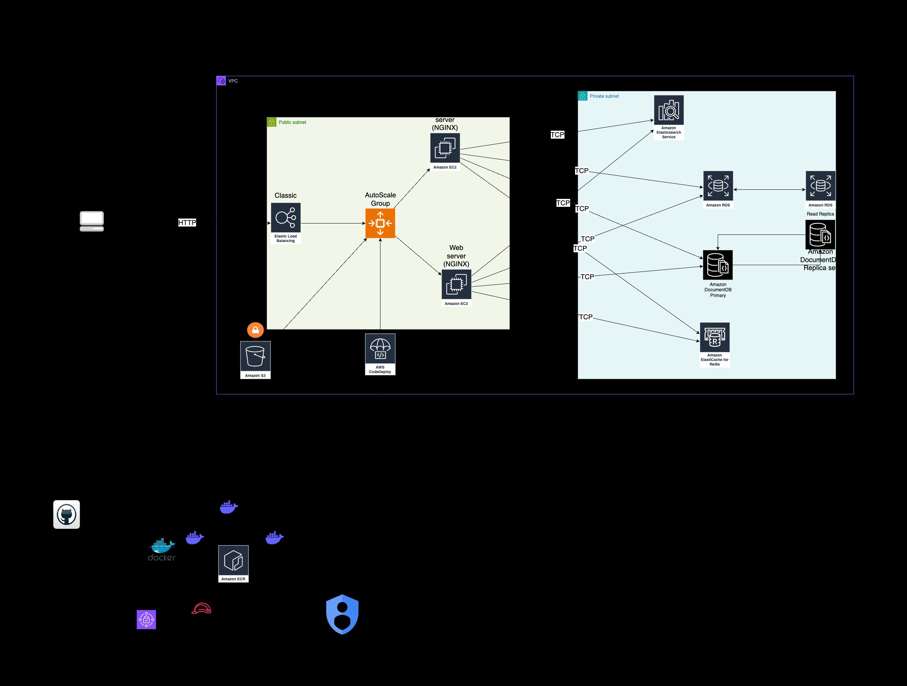

# Example App

A **Parking** app for demonstration purposes.

## Pre-requisites

- **Docker** and **Docker Compose** installed
- **PHP 8.2** or higher
- **Composer** installed

## Technologies used

- **MongoDB** for storing cars
- **MySQL** for stоring drivers and the vehicle categories they can drive
- **Redis** for caching MongoDB aggregations
- **Elasticsearch** for indexing cars and searching them
- **Docker** for keeping an image of the last successful build
- **Github Actions** for a github workflow
  - Cache Composer
  - PHP Stan
  - PHP CS Fixer
  - Yaml validation
  - CliMarkDown
  - Editorconfig checker
  - Snyk
  - SonarCloud
  - Gitleaks
  - Docker build process
  - Manual Approval
- **AWS** for deployment
  - VPC
  - ELB
  - ASG
  - DocumentDB
  - RDS
  - ElastiCache
  - CodeDeploy
  - OpenSearch
  - S3
- [**Terraform**](https://github.com/VasilHristovDev/mdp_project/tree/main/terraform) for automation of deployment

## Project Setup

1. Copy the **.env.project** contents into **.env** file
   > cp .env.example .env
2. Run the sail environment:
   > ./vendor/bin/sail up -d --build
3. Run the migrations:
   > ./vendor/bin/sail artisan migrate
4. Generate a key:
   > ./vendor/bin/sail artisan key:generate
5. Install all dependencies from composer
   > ./vendor/bin/sail composer install

## Functionality

- Register a car in the parking lot: **(POST)**
  > <http://localhost/api/register>
  - registrationPlate
  - brand
  - model
  - color
  - category **(A,B or C)**
  - card (Silver, Gold or Platinum)
- Unregister a car in the parking lot: **(POST)**
  > <http://localhost/api/exit>
  - registrationPlate
- See available parking slots: **(GET)**
  > <http://localhost/api/available>
- Check the current sum of a vehicle in the parking lot: **(GET)**
  > <http://localhost/api/check/{registrationPlate}>
- Check the number of unique cars entered the parking lot for a period: **(GET)**
  > <http://localhost/api/check/cars/unique>
  - dateStart **(String)**
  - (_optional_) dateEnd **(String)**
- Check the amount of money earned in a period: **(GET)**
  > <http://localhost/api/check/cars/sum>
  - dateStart **(String)**
  - (_optional_) dateEnd **(String)**

## Jobs and Workers

- > php send:aggregations - Checks the amount of money and number
  of cars entered the parking lot for
- >php elastic:index - Indexes all the cars in elasticsearch

## Future improvements

- Improve terraform code
- Add more tests
- Find a way to distribute the workers with environment variables remotely

## Research done

- [x] Ansible
- [x] Terraform
- [x] AWS
- [x] Docker
- [x] Docker Compose
- [x] Redis
- [x] MongoDB
- [x] MySQL
- [x] Elasticsearch
- [x] Hashicorp Vault
- [x] AWS Appconfig
- [x] AWS CodeDeploy
- [x] AWS S3
